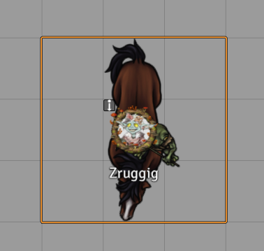

# Mount Up!

 

[](https://forge-vtt.com/bazaar#package=foundryvtt-mountup) 


[](https://www.foundryvtt-hub.com/package/foundryvtt-mountup/)


**Mount Up!** is a module for [Foundry VTT](https://foundryvtt.com/  "Foundry VTT") that allows tokens to carry or be carried by other tokens. This is completely system agnostic, and fully customizable to fit right into your game.

## NOTE: If you are a javascript developer and not a typescript developer, you can just use the javascript files under the dist folder

# Installation
It's always better and easier to install modules through in in app browser. Just search for "Mount Up!"

To install this module manually:
1. Inside the Foundry "Configuration and Setup" screen, click "Add-on Modules"
2. Click "Install Module"
3. In the "Manifest URL" field, paste the following url:
`https://raw.githubusercontent.com/p4535992/MountUp/master/src/module.json`
4. Click 'Install' and wait for installation to complete
5. Don't forget to enable the module in game using the "Manage Module" button

### libWrapper

This module uses the [libWrapper](https://github.com/ruipin/fvtt-lib-wrapper) library for wrapping core methods. It is a hard dependency and it is recommended for the best experience and compatibility with other modules.

### token-attacher

This module uses the [token-attacher](https://github.com/KayelGee/token-attacher) library like a dependency. It is a hard dependency and it is recommended for the best experience and compatibility with other modules.

### token-z

This module uses the [token-z](https://github.com/theripper93/token-z) library like a dependency. It is a hard dependency and it is recommended for the best experience and compatibility with other modules.

## Known issue

- if you scale the token mount the rider position can be a little out of coordinates
- the multi rider functionality on the same mount work partially, but it should be enough for most use cases

# Usage

## Mounting

To mount a token:
1. Select the "rider" and the "mount" tokens.
2. Right click on the "mount" icon to bring up the token HUD.
3. Click on the horse icon (you can change this in your game).\
\
*The rider will now be linked to the mount. Anywhere the mount moves, the rider follows.*

## Dismounting

To dismount a token from a token:
1. Right click on the "mount" to bring up the token HUD.
2. Click on the dismount icon.\
\
*The rider will now be un-linked from the mount, and is free to move on their own.*

## Partial multi mounting is supported



## Hooks and API

Some functionality is exposed to macros for repeatable usage. All macros will either accept a token ID or name (case insensitive).

#### Macro to Mounting

You can mount a rider to a mount using the following syntax:

`MountUp.mount('RiderNameOrId', 'MountNameOrId')`

or you can use the module 'token-attacher'

### Macro to Dismounting

You can have a rider dismount by passing it's token name or id:

`MountUp.dismount('RiderNameOrId)`

or you can use the module 'token-attacher'

### Macro to Drop a rider from a mount

You can have a mount drop its rider by passing the mount's name or id:

`MountUp.dropRider('MountNameOrId')`

### Macro function to toggle a rider mount pair

You can have a mount drop its rider by passing the mount's name or id:

`MountUp.toggleMount('RiderNameOrId', 'MountNameOrId')`

# Build

## Install all packages

```bash
npm install
```
## npm build scripts

### build

will build the code and copy all necessary assets into the dist folder and make a symlink to install the result into your foundry data; create a
`foundryconfig.json` file with your Foundry Data path.

```json
{
  "dataPath": "~/.local/share/FoundryVTT/"
}
```

`build` will build and set up a symlink between `dist` and your `dataPath`.

```bash
npm run-script build
```

### NOTE:

You don't need to build the `foundryconfig.json` file you can just copy the content of the `dist` folder on the module folder under `modules` of Foundry

### build:watch

`build:watch` will build and watch for changes, rebuilding automatically.

```bash
npm run-script build:watch
```

### clean

`clean` will remove all contents in the dist folder (but keeps the link from build:install).

```bash
npm run-script clean
```
### lint and lintfix

`lint` launch the eslint process based on the configuration [here](./.eslintrc)

```bash
npm run-script lint
```

`lintfix` launch the eslint process with the fix argument

```bash
npm run-script lintfix
```

### prettier-format

`prettier-format` launch the prettier plugin based on the configuration [here](./.prettierrc)

```bash
npm run-script prettier-format
```

### package

`package` generates a zip file containing the contents of the dist folder generated previously with the `build` command. Useful for those who want to manually load the module or want to create their own release

```bash
npm run-script package
```

## [Changelog](./changelog.md)

## Issues

Any issues, bugs, or feature requests are always welcome to be reported directly to the [Issue Tracker](https://github.com/p4535992/MountUp/issues ), or using the [Bug Reporter Module](https://foundryvtt.com/packages/bug-reporter/).

## License

This package is under an [MIT license](LICENSE) and the [Foundry Virtual Tabletop Limited License Agreement for module development](https://foundryvtt.com/article/license/).

## Acknowledgements

Bootstrapped with League of Extraordinary FoundryVTT Developers  [foundry-vtt-types](https://github.com/League-of-Foundry-Developers/foundry-vtt-types).

Mad props to the 'League of Extraordinary FoundryVTT Developers' community which helped me figure out a lot.
